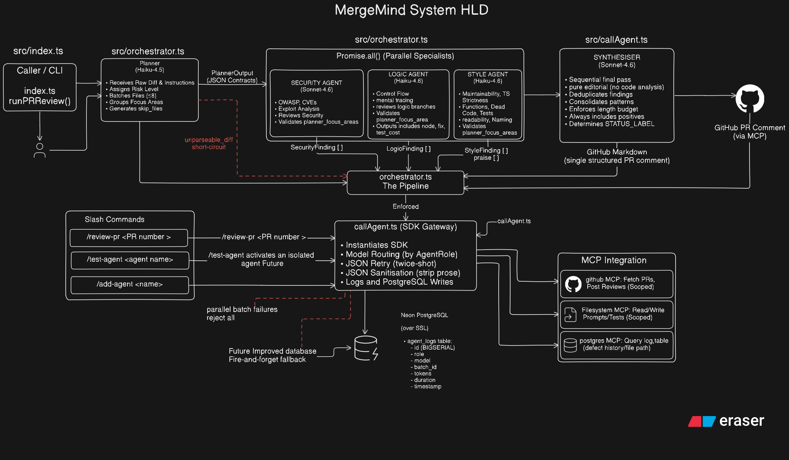
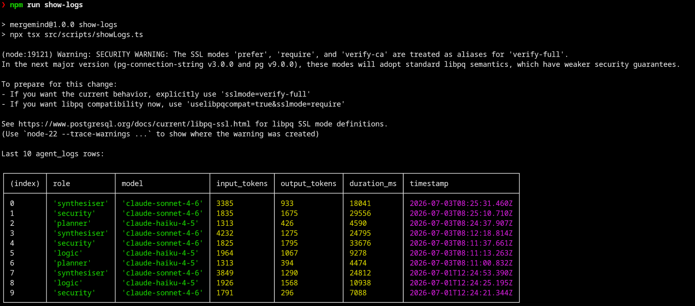
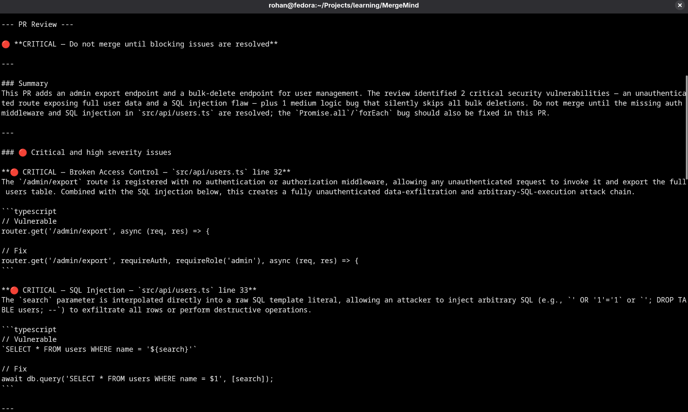
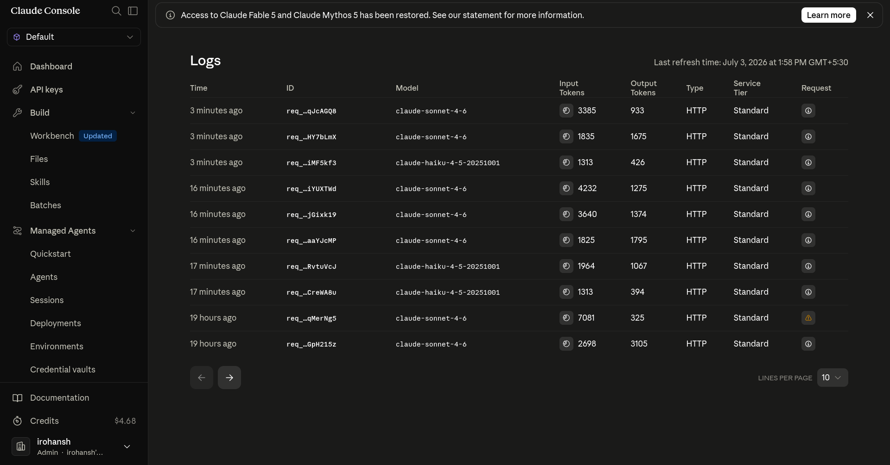
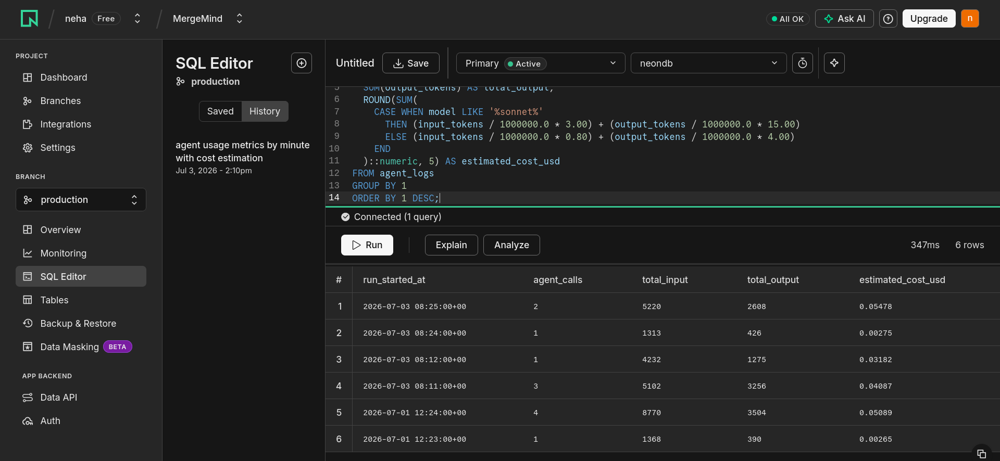
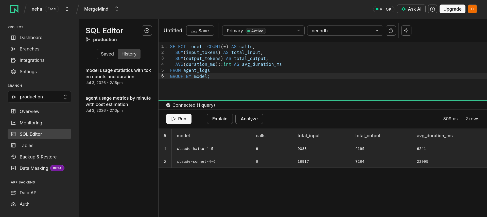

# MergeMind

MergeMind is a multi-agent GitHub pull request review system built in TypeScript. It orchestrates five specialised AI agents in a structured pipeline to produce security, logic, and style analysis on a PR diff, then synthesises the findings into a single human-readable GitHub review comment.

---

## System Architecture



The pipeline runs in three stages:

1. **Planner** — reads the full diff and produces a structured decomposition: which files go to which specialist agent, in what batches, and with what focus areas.
2. **Security + Logic + Style** — three specialist agents run in parallel. Each receives only the files and focus areas the Planner assigned to it.
3. **Synthesiser** — receives all specialist outputs and composes a single, deduplicated GitHub-flavoured Markdown review comment.

---

## Agents

| Agent | Model | Responsibility |
|---|---|---|
| Planner | claude-haiku-4-5 | Decomposes the diff into typed batches with risk levels and focus areas |
| Security | claude-sonnet-4-6 | OWASP Top 10 audit, Node.js-specific vulnerability patterns |
| Logic | claude-haiku-4-5 | Correctness bugs — async errors, null paths, race conditions, resource leaks |
| Style | claude-haiku-4-5 | TypeScript strictness, naming, dead code, test quality, maintainability |
| Synthesiser | claude-sonnet-4-6 | Merges all findings into a single, prioritised GitHub review comment |

Sonnet is used for Security and Synthesiser (deep reasoning). Haiku is used for Planner, Logic, and Style, cutting per-call inference cost by ~73% on those roles (Haiku is roughly 3.75× cheaper per token than Sonnet). Measured whole-pipeline savings depend on how token volume splits between models — on the logged run below it was ≈ 25–30%.

---

## Project Structure

```
src/
  index.ts            Entry point — runs a sample PR through the pipeline
  orchestrator.ts     Pipeline coordinator: Planner -> parallel specialists -> Synthesiser
  lib/
    callAgent.ts      Single Anthropic SDK entry point with model routing, retry, and logging
  prompts/
    planner.ts
    security.ts
    logic.ts
    style.ts
    synthesiser.ts
  types/
    agents.ts         All shared TypeScript types (PlannerOutput, SecurityFinding, etc.)
  db/
    client.ts         Postgres client for agent log persistence
    schema.sql        agent_logs table definition
  tests/
    testAgent.ts      CLI test runner for individual agents
    fixtures/         Sample JSON payloads for each agent
```

---

## Prerequisites

- Node.js 20+
- An Anthropic API key with access to claude-haiku-4-5 and claude-sonnet-4-6
- A PostgreSQL instance — **optional** for the demo. Agent-log writes are best-effort, so `npm start` still completes without a database (logging degrades to console warnings); a reachable Postgres is only required for observability.
- `GITHUB_TOKEN` is **only** needed for the Claude Code `/review-pr` workflow — `npm start` does not use it.

---

## Setup

**1. Clone and install dependencies**

```bash
git clone <repo-url>
cd mergemind
npm install
```

**2. Configure environment variables**

Copy `.env.example` to `.env` and fill in the values:

```bash
cp .env.example .env
```

```env
ANTHROPIC_API_KEY=your_anthropic_api_key_here
GITHUB_TOKEN=your_github_token_here
DATABASE_URL=your_postgres_database_url_here
```

`GITHUB_TOKEN` is only needed for the Claude Code `/review-pr` workflow — `npm start` works without it.

**3. Initialise the database**

Run the schema against your Postgres instance:

```bash
psql $DATABASE_URL -f src/db/schema.sql
```

This creates the `agent_logs` table used to record every agent call with token counts and latency.

The database is optional for the demo: the log insert is best-effort (catch-wrapped), so `npm start` still completes without a reachable Postgres — you just lose observability.

---

## Running the Pipeline

**Run the full review on the bundled sample PR:**

```bash
npm start
```

This executes `src/index.ts`, which passes a sample diff through the complete five-agent pipeline and prints the final Markdown review to stdout.

**Type-check without running:**

```bash
npm run typecheck
```

---

## Testing Individual Agents

Each agent can be tested in isolation using a fixture file:

```bash
npm run test:planner
npm run test:security
npm run test:logic
npm run test:style
npm run test:synthesiser
```

These commands load the corresponding fixture from `src/tests/fixtures/`, call the agent, and print its JSON output along with token usage and estimated duration.

---

## Proof of Execution

The following screenshots capture a live end-to-end run of MergeMind against a real pull request.

### 1. Agent log table — pipeline run recorded in Postgres

Every agent call from a PR review is persisted to the `agent_logs` table. Each row records the role, model, token counts, and wall-clock latency. The total number of calls **varies per run** — it is 1 Planner + N specialist batch calls (N depends on how the Planner batches the diff) + 1 Synthesiser, so counts differ between PRs and any parse-retry adds cost to an existing row rather than a new one. Every row now carries a `run_id`, so a single run can always be isolated with `WHERE run_id = '…'` rather than inferred from a time window that may span several runs.



---

### 2. Synthesised PR review — terminal output

The Synthesiser agent's final output, printed to stdout. This comment is ready to post directly to GitHub. The review correctly identified two critical security vulnerabilities in the sample PR: a missing auth middleware on the `/admin/export` route and a raw SQL injection in `src/api/users.ts`.



---

### 3. Anthropic Console — API call logs

All Anthropic API requests made during the pipeline run are visible in the Anthropic Console. The log confirms both `claude-sonnet-4-6` (Security, Synthesiser) and `claude-haiku-4-5` (Planner, Logic, Style) were called in the correct routing order.



---

### 4. NeonDB — per-minute cost breakdown

A SQL query over `agent_logs` computes the estimated cost of each pipeline run, grouped by minute. This query is the basis for operational cost monitoring.



---

### 5. NeonDB — model usage breakdown

A breakdown of total token consumption and average latency per model, aggregated across two pipeline runs in the query window. Haiku handled 6 calls at 6 241 ms average latency. Sonnet handled 6 calls at 22 995 ms — consistent with its deeper reasoning workload. These are single-sample values from one session, not a benchmark — no p50/p95.

| Model | Calls | Total Input Tokens | Total Output Tokens | Avg Latency (ms) |
|---|---|---|---|---|
| claude-haiku-4-5 | 6 | 9 088 | 4 195 | 6 241 |
| claude-sonnet-4-6 | 6 | 16 917 | 7 264 | 22 995 |

*(figures from one representative run)*



---

## Slash Commands

The following Claude Code slash commands are available under `.claude/commands/`, which is committed to the repo along with the MCP server config (`.claude/settings.json`) — a fresh clone gets the full Claude Code workflow. The config references `${GITHUB_TOKEN}` and `${DATABASE_URL}` from your environment; no secrets are stored in it.

| Command | Description |
|---|---|
| `/review-pr <PR number>` | Fetch a PR from GitHub, run the full pipeline, and post the review comment |
| `/test-agent <agent name>` | Test a single agent using its fixture file |
| `/add-agent <agent name>` | Scaffold a new agent: prompt file, type, model routing entry, and test |

---

## Adding a New Agent

1. Create `src/prompts/newAgent.ts` and export `NEW_AGENT_SYSTEM_PROMPT`.
2. Add the response type interface to `src/types/agents.ts`.
3. Add the model routing entry and prompt import to `src/lib/callAgent.ts`.
4. Wire the agent into `src/orchestrator.ts` at the correct pipeline position.
5. Add a fixture file to `src/tests/fixtures/` and a test to `src/tests/`.

Or run `/add-agent <name>` and Claude will scaffold steps 1–4 automatically.

---

## Agent Logging

Every agent call is logged to the `agent_logs` Postgres table:

| Column | Type | Description |
|---|---|---|
| run_id | TEXT | UUID identifying the pipeline run; lets rows from one run be isolated |
| role | TEXT | Agent name (planner, security, logic, style, synthesiser) |
| model | TEXT | Model ID used for the call |
| batch_id | TEXT | Batch identifier assigned by the Planner |
| input_tokens | INTEGER | Tokens in the request |
| output_tokens | INTEGER | Tokens in the response |
| duration_ms | INTEGER | Wall-clock latency in milliseconds |
| timestamp | TIMESTAMPTZ | UTC time of the call |

Every call gets exactly one row — the log write lives inside `callAgent.ts`, the only place the SDK is imported, so no call path can bypass it. When the JSON-parse retry fires, the retry request's token usage and latency are folded into that same row, so cost metrics stay accurate on retried calls. The insert itself is best-effort — a DB outage degrades to console warnings without failing the review.

---

## Claude Code Integration (MCP)

MergeMind has two interfaces. `npm start` runs the self-contained Node pipeline — it does **not** call MCP at runtime. The second interface is Claude Code: the slash commands above use three MCP servers as the agent-tooling layer around the pipeline:

- `@modelcontextprotocol/server-github` — fetch PR diffs and metadata, post the review comment back to GitHub
- `@modelcontextprotocol/server-filesystem` — read and write local prompt files and review logs
- `@modelcontextprotocol/server-postgres` — query the `agent_logs` table (tokens, latency, cost)

---

## Batching and Rate Limits

The Planner groups files into batches of **at most 8 files per call**, keeping each individual agent call within Tier 1 token-per-minute limits (30k tokens/min on Sonnet). On top of the per-call cap, specialist batches now run under an **aggregate concurrency cap of 2** (via `p-limit`) shared across the Security, Logic, and Style agents, so even a very large PR cannot fan out unbounded parallel calls. Transport-level failures (HTTP 429 and 5xx) are retried with **exponential backoff and full jitter** (3 attempts), separately from the JSON-parse retry. Lock files, minified assets, and auto-generated migration files are excluded from all batches.

---

## Technology Stack

- **Runtime:** Node.js 20+ with TypeScript (ESM, NodeNext module resolution)
- **AI:** Anthropic SDK (`@anthropic-ai/sdk`)
- **Database:** PostgreSQL via `pg`
- **MCP (Claude Code workflow only):** `@modelcontextprotocol/server-github`, `server-filesystem`, `server-postgres`
- **Execution:** `tsx` for direct TypeScript execution without a build step

---

## License

ISC
